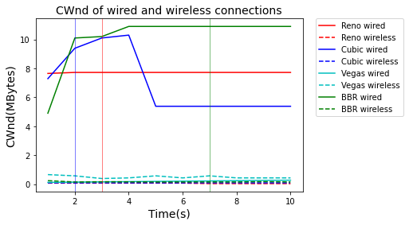

<h2><center>CS244 Assignment 2</center></h2>

<center>Ziyi Yang</center>

<h3>How each TCP variance congestion algorithm works</h3>

<h4>TCP Reno</h4>

TCP Reno implements an **Additive Increase, Multiplicative Decrease** (AIMD) algorithm. There are basically two important phases for window adjustments. 

1. **Slow Start (SS)**

​	In this phase, the window size increases exponentially. This phase is initiated after a loss is detected by time-out. The limit of this phase is found when the window reaches a threshold called **Slow Start Threshold (ssthresh)** 

2. **Congestion Avoidance (CA)**

   This phase begins at the end of Slow Start or after a loss is detected by the reception of duplicate ACKs. TCP continues to increase its congestion window as ${1/CWnd}$ each time it receives an ACK.

The **fast retransmit**and **fast recovery** (RTO) flows are shown as follows.

For **fast retransmit**, when packet loss is detected and time-out expires and the package has not been confirmed, for the reception of three duplicate ACKs. In this case, it must retransmit only the package supposed to be lost, but not the rest of the packages, without waiting for the time-out to expire. The **congestion avoidance phase** is performed again. 

For **fast recovery**, it goes as follows.

* ssthresh is set to **half the current value** of the congestion window
* The congestion window, **cwnd** is set to **ssthresh value** plus **3 times the package size**
* Each time the sender receives a duplicate ACK, **cwnd** increases in one packet and sends a new packet
* When the first non-duplicate ACK arrives, **cwnd** is set to **ssthresh value**

For TCP Reno, there are three assumption for its congestion avoidence algorithm.

1. Packet loss is always caused by network congestion
2. RTT and bandwidth are stable
3. After setting ssthresh to half, the buffer can be cleared.

Causing problems:

1. Low utilization of network bandwidth
2. Not good for high RTT situation

<h4>TCP CUBIC</h4>

This is the default variant implemented for Linux. Compared to other variants, the main difference is the **scalability** that the window updates are independent of RTT, achieving a better distribution of bandwidth among all active sessions.

It has the same **slow start**, **fast retransmit**, and **fast recovery** as TCP Reno. The main difference is the way of adjusting the congestion window, replacing the linear growth function of a standard TCP for a cubic function in order to achieve the improvement mentioned above.

On loss, the congestion window value reached is recorded as $W_{max}$ and the window is decreased by a factor $\beta = 0.2$.

The new window is calculated as: $W(t)=C(t-K)^3 + W_{max}$ ， where $C$ and $K$ are to be determined such that $W_{max}$ be the turning point of the function $W(t)$ , $t$ is the time since the last window reduction.

The standard $W_{TCP}(t) = W_{max} * (1- \beta) + 3 * {\beta \over 2-\beta} * {t \over RTT}$ 

The window size grows as follow for each ACK received

* If $W(t) < W_{TCP}(t)$,  the window value is $W_{TCP}(t)$
* If $W(t)< W_{max}$ , then it is in the concave region of the curve or stable mode, the window is adjusted according to $W(t)$
* If $W(t)> W_{max}$ , then it is in the convex region of the curve or exploratory mode, the window is adjusted according to $W(t)$

 Advantage:

Get rid of RTT, much fairer 

Problem:

When bandwidth changes, CWND is following slow

<h4>TCP Vegas</h4>

The proactive character of Vegas is that it determines if there is an **incipient congestion** by observing the difference between the **actual throughput** (that calculated from RTT measurement) and the **maximum** (which is calculated at the start of the session).  TCP Vegas adjusts the delivery rate of the source node in order to maintain **a small number of packets** in the buffers of the routers.

During the **Congestion Avoidance** phase, the CWnd is adjusted as:

$$ CWnd=\left\{
\begin{array}{rcl}
CWnd + 1       &      & {Diff < \alpha}\\
CWnd - 1    &      & {Diff > \beta}\\
CWnd       &      & {otherwise}
\end{array} \right. $$

where $Diff = (Expected - Actual)$, $Expected = CWnd/BaseRTT(minimum RTT)$, $Actual = CWnd/RTT$,

For **slow start**, it increases $CWnd$ **exponentially** every two RTT. This phase ends when a growth is found in the buffer queues, which means the congestion window reaches a value for which $Diff = (Expected - Actual)$  exceeds the threshold $\delta$. After this, Vegas enters **Congestion Avoidance Phase**. 

Problems

1. CWnd grows linearly, not good for bandwidth utilization
2. Incomptible with other packet loss based algorithm. 

<h4>TCP BBR</h4>

BBR (**B**ottleneck **B**andwidth and **R**ound-trip propagation time) is a new variance of TCP invented by Google. It overcomes the problems from **loss-based congestion control**. The algorithm responds to actual congestion. Rather than packet loss, BBR tackles this with a ground-up rewrite of congestion control. It considers how fast the network is delivering data. For a given network connection, it uses recent measurements of the **network's delivery rate** and **round-trip time** to build an explicit model that includes both the maximum recent bandwidth available to that connection, and its minimum recent round-trip delay. 

There are four phases in total:

1. Startup -> Push a lot of buffers into network, filling the buffer queue
2. Drain -> Clear the buffer queue, monitoring on RTT
3. ProbeBW -> measure the bandwidth. Try to find a highest throughput with stable RTT(no lower RTT recieved for updating)
4. probeRTT-> measure the RTT 


<h3>Experiment</h3>

<h4>Environment</h4>

I used **Parallel** virtual machine installed on my **MacBook Pro** with **M1** chip for testing. The wried network interface of the virtual machine is **bridged** connected to the host (MacBook). The wireless network interface is using shared network.

| Property           | Description                                                  |
| ------------------ | ------------------------------------------------------------ |
| Operating System   | Debian GNU Linux 11.3, with 5.10.0 kernel version            |
| Architecture       | ARM64                                                        |
| Wired Interface    | Bridged to the host, connected using 1Gbps cable. The ip is **10.68.202.231** |
| Wireless Interface | Shared network The IP is **10.211.55.12**                    |

<h4>Installation and kernel parameter changing</h4>

1. For iperf3, I installed it using cmd 

```bash
sudo apt install iperf3
```

2. Kernel parameter changing

​	Firsudo stly,  load into **sysconf file** using cmd:

```bash
sudo nano /etc/sysctl.conf
```

​	 Secondly, modify the file and set the parameter to TCP variant for testing. The lines to add are

```c
net.core.default_qdisc=fq
net.ipv4.tcp_congestion_control=bbr  //for example we want bbr variant
```

​	After that, reload systcl in the terminal using cmd

```bash
sudo sysctl -p
```

​	Then, check the current using tcp control protocol with cmd

```bash
sysctl net.ipv4.tcp_congestion_control
```

<h4>TCP throughput over wired and wireless channels</h4>

For this experiment, I tested from the virtual machine of my laptop to public iperf server in France *ping.online.net* . I used cmd

```bash
iperf3 -c ping.online.net -p 5205 -t 10 
```

Actually, before generating the following figures, I tried to do the same experiment with 0.1s interval for 20s. The figure has too many lines and looks a little bit messy. Therefore, I decided to do the experiment for 10s with 1s interval.


**Results**

The experiment results are recorded as follows.

- TCP Reno

**Wired**: Sender 238Mbits/s Receiver 238Mbits/s

| Parameter           | 1s   | 2s   | 3s   | 4s   | 5s   | 6s   | 7s   | 8s   | 9s   | 10s  |
| ------------------- | ---- | ---- | ---- | ---- | ---- | ---- | ---- | ---- | ---- | ---- |
| Cwnd (MBytes)       | 7.65 | 7.72 | 7.72 | 7.72 | 7.72 | 7.72 | 7.72 | 7.72 | 7.72 | 7.72 |
| Bitrate (Mbits/sec) | 101  | 240  | 242  | 252  | 252  | 262  | 241  | 261  | 274  | 252  |
| Retr                | 0    | 0    | 36   | 0    | 0    | 0    | 0    | 0    | 0    | 0    |

**Wireless**: Sender 114Mbits/sec Receiver 113Mbits/sec

| Parameter           | 1s   | 2s   | 3s   | 4s   | 5s   | 6s   | 7s   | 8s   | 9s   | 10s  |
| ------------------- | ---- | ---- | ---- | ---- | ---- | ---- | ---- | ---- | ---- | ---- |
| Cwnd (kBytes)       | 68.4 | 68.4 | 68.4 | 68.4 | 68.4 | 68.4 | 34.2 | 34.2 | 34.2 | 34.2 |
| Bitrate (Mbits/sec) | 45.8 | 109  | 120  | 167  | 172  | 170  | 103  | 76.8 | 91.0 | 83.2 |
| Retr                | 0    | 0    | 0    | 0    | 0    | 0    | 1    | 2    | 1    | 1    |

- TCP Cubic

**Wired**: Sender 217Mbits/sec Receiver 217Mbits/sec

| Parameter           | 1s   | 2s   | 3s   | 4s   | 5s   | 6s   | 7s   | 8s   | 9s   | 10s  |
| ------------------- | ---- | ---- | ---- | ---- | ---- | ---- | ---- | ---- | ---- | ---- |
| Cwnd (MBytes)       | 7.29 | 9.39 | 10.1 | 10.3 | 5.38 | 5.38 | 5.38 | 5.38 | 5.38 | 5.38 |
| Bitrate (Mbits/sec) | 76.6 | 200  | 230  | 253  | 241  | 241  | 231  | 230  | 242  | 230  |
| Retr                | 0    | 187  | 0    | 0    | 0    | 0    | 0    | 0    | 0    | 0    |

**Wireless**: Sender 141Mbits/sec Receiver 141Mbits/sec

| Parameter           | 1s   | 2s   | 3s   | 4s   | 5s   | 6s   | 7s   | 8s   | 9s   | 10s  |
| ------------------- | ---- | ---- | ---- | ---- | ---- | ---- | ---- | ---- | ---- | ---- |
| Cwnd (kBytes)       | 65.6 | 65.6 | 65.6 | 65.6 | 65.6 | 65.6 | 65.6 | 65.6 | 65.6 | 65.6 |
| Bitrate (Mbits/sec) | 60.9 | 108  | 128  | 146  | 159  | 152  | 163  | 172  | 167  | 158  |
| Retr                | 0    | 0    | 0    | 0    | 0    | 0    | 0    | 0    | 0    | 0    |

- TCP Vegas

**Wired**: Sender:18.3Mbits/sec Receiver: 17.3Mbits/sec

| Parameter           | 1s   | 2s   | 3s   | 4s   | 5s   | 6s   | 7s   | 8s   | 9s   | 10s  |
| ------------------- | ---- | ---- | ---- | ---- | ---- | ---- | ---- | ---- | ---- | ---- |
| Cwnd (KBytes)       | 119  | 136  | 153  | 170  | 187  | 202  | 219  | 236  | 252  | 269  |
| Bitrate (Mbits/sec) | 12.9 | 12.5 | 13.6 | 15.1 | 19.9 | 19.2 | 19.9 | 20.8 | 21.9 | 27.9 |
| Retr                | 0    | 0    | 0    | 0    | 0    | 0    | 0    | 0    | 0    | 0    |

**Wireless**: Sender:182Mbits/sec Receiver: 182Mbits/sec

| Parameter           | 1s   | 2s   | 3s   | 4s   | 5s   | 6s   | 7s   | 8s   | 9s   | 10s  |
| ------------------- | ---- | ---- | ---- | ---- | ---- | ---- | ---- | ---- | ---- | ---- |
| Cwnd (KBytes)       | 65.6 | 5.70 | 38.5 | 4.28 | 5.70 | 4.28 | 5.70 | 4.28 | 4.28 | 4.28 |
| Bitrate (Mbits/sec) | 75.1 | 200  | 148  | 230  | 194  | 192  | 195  | 201  | 192  | 194  |
| Retr                | 0    | 0    | 0    | 0    | 0    | 0    | 0    | 0    | 0    | 0    |

- TCP BBR

**Wired**: Sender:273Mbits/sec Receiver: 273Mbits/sec

| Parameter           | 1s   | 2s   | 3s   | 4s   | 5s   | 6s   | 7s   | 8s   | 9s   | 10s  |
| ------------------- | ---- | ---- | ---- | ---- | ---- | ---- | ---- | ---- | ---- | ---- |
| Cwnd (MBytes)       | 4.90 | 10.1 | 10.2 | 10.9 | 10.9 | 10.9 | 10.9 | 10.9 | 10.9 | 10.9 |
| Bitrate (Mbits/sec) | 72.4 | 304  | 304  | 293  | 294  | 273  | 273  | 304  | 294  | 315  |
| Retr                | 0    | 0    | 0    | 0    | 0    | 0    | 7    | 0    | 0    | 0    |

**Wireless**: Sender:155Mbits/sec Receiver: 152Mbits/sec

| Parameter           | 1s   | 2s   | 3s   | 4s   | 5s   | 6s   | 7s   | 8s   | 9s   | 10s  |
| ------------------- | ---- | ---- | ---- | ---- | ---- | ---- | ---- | ---- | ---- | ---- |
| Cwnd (kBytes)       | 237  | 145  | 163  | 154  | 145  | 145  | 148  | 145  | 171  | 148  |
| Bitrate (Mbits/sec) | 63.7 | 126  | 161  | 211  | 205  | 211  | 205  | 217  | 179  | 162  |
| Retr                | 0    | 0    | 0    | 0    | 0    | 0    | 0    | 0    | 0    | 0    |

Throughput of wired and wireless connections among different variances and the conrresponding CWnds. 




**Analysis**

* Wired vs Wireless

​		If we see the figure straight forwardly, we may feel that wired TCP variances have generally higher throughputs than wireless ones. However, for the environment settings of my experiment, it is not fair to do this comparison since wired connections are using bridged network interface (VM is a peer in the subnet of the host) and wireless connections are using shared network (VM network is bounded by the host's TCP protocol).  The wireless one needs to pass the host's network to send and recieve packets, this makes the wireless connection influenced by the host network a lot.

* Flavor throughputs comparision

​		For variance comparison, we only consider wired connections. The one with the highest throughput is BBR, whereas the lowest is Vegas.  

​		For the reason why Vegas becomes the lowest is that the congestion control targets at making the network buffer utilized at a certain percentage, whereas all other flavors try to occupy the buffer fully. This makes Vegas not comparable on throughput with the other flavors. 

​		For the reason why BBR becomes the highest is that BBR will not over-react for packet loss. After ProbeBW (measuring bandwidth) stage, the CWnd will not change too much even loss packets.  It targets at occupying BDP (Bandwidth Delay Product = max BW $\times$ Min RTT), which is the maximum capacity the network can handle.  Cubic and Reno are both packet-loss based. When packet loss happened, they will decrease their Cwnds. 

* Packet loss and Cwnd

  The three vertical lines in blue, red and green show how the CWnd changes of Cubic, Reno and BBR respectively due to packet loss. For Cubic and Reno, after the first packet loss happens, **ssthresh** is set. For BBR, it does not have a lot of affect since it is not loss-based congestion control.


<h4>TCP packet delay considering all variance flavors</h4>

For this experiment, we need to get the packet delay message of each TCP flavour. I used cmd 

```bash
iperf3 -c ping.online.net -p 5205 -t 20 -J -i 0.1
```

This means the experiment is ran for 20s and the output is in Json format. In the Json file, the average and variance of **RTT**s for each second is shown. Based on this parameter, we can see the packet delay changes for each TCP variance.

I ran this experiment for all four flavors through the wired network interface of the VM.

**Results**

Packet delay changes for different flavors and conrresponding CWnds


**Analysis**

* Delay among flavors

  From the figure, we can see that Vegas has the lowest delay among all variances, whereas Cubic, BBR and Reno have comparable delay. For more details, we can see that BBR has larger variance because of the significant changes of CWnd. 

* Cwnd changes among different flavors

​		From the figure, we can see that BBR has the highest CWnd on average. However at about 11s, there is a dramatically decrease of window size. This is basically because that BBR does not react to packet loss immediatly. However, when packet loss rate comes to a threshold , BBR will "accidentally" react to the packet loss by shrinking the window size.

​		Vegas has the lowest CWnd window size, since the congestion control of it does not targetting at making the network buffer full, whereas others all targetting at making it full. BBR has the highest since packet loss happens a lot in real environment, BBR does not over-react to packet loss, this gives it a huge advantage.

**Optimal TCP flavor in terms of throughput and delay**

For the experiments above, we can see that BBR has the highest throughput and comparable the second lowest average delay. 

The BBR delay and throughput figure is shown as follows.


Loss-based congestion control fills buffer, achieves full throughput, but induces queuing delay. TCP BBR doesn’t fill buffer, estimates bottleneck bandwidth and sends at that rate. TCP BBR operates at the BDP, Also tries to estimate what link RTT is without queueing delay.

<h4>Wireshark experiment</h4>
I also used **wireshark** for catching tcp packets. Since **iperf** is giving analysis per second, the packet based analysis will be much more precise.

I used cubic tcp variance for the same public server shown as previous.


The green line are received packets, the blue block are captrued sending packets and the yelloe line is sequence number that already acked.

